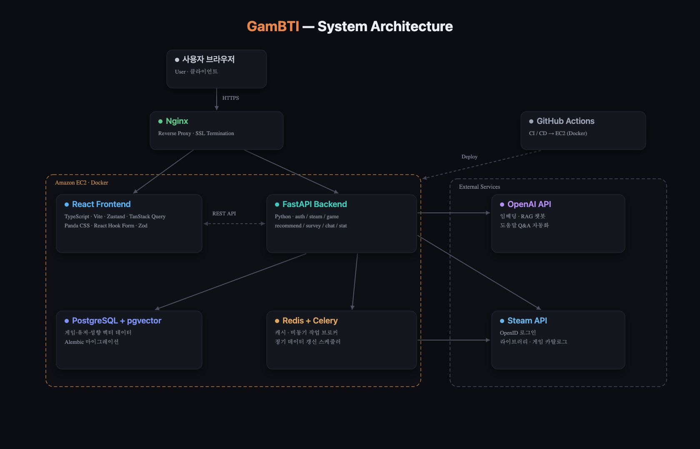

## 🎮 프로젝트 소개

>Steam에는 수만 개의 게임이 있지만, 유저는 "내 취향에 맞는 다음 게임"을 고르기 어렵습니다.
>`GamBTI`는 유저의 실제 Steam 라이브러리와 플레이 데이터를 분석해 **게임 성향(GamBTI)** 을 진단하고,
>그 성향에 맞는 게임을 추천해 게임 탐색의 피로를 줄여주는 서비스입니다.
>
>마치 MBTI처럼, 게임 플레이 패턴을 **6가지 성향 유형**으로 진단합니다.

---

## :link: 배포 링크

> ### [🎮 GamBTI 바로가기](https://app.gembti.cloud)

---

## 🗣️ 프로젝트 발표 문서

> ### 🗓️ 프로젝트 기간 : 2026.05.19 - 2026.06.24
> ### [📑 발표 문서](https://docs.google.com/presentation/d/1zFvziDymChV4MRwcixF-GZXYc8iDCg43jeYiSF-M2uI/edit?usp=sharing)

---

## 🖥️ 서비스 소개

|   메인 화면   |  성향 진단(GamBTI)  |   Steam 로그인   |
|:--------:|:------:|:--------:|
|  |  |  |

|   추천 결과   |  테마 큐레이션  |   설문 추천   |
|:--------:|:------:|:--------:|
|  |  |  |

|   AI 챗봇 고객센터   |  라이브러리 동기화  |   마이페이지   |
|:--------:|:------:|:--------:|
|  |  |  |

---

## 🧰 사용 스택

### :wrench: System Architecture

### FE

  
  
  
   

  
  
  
  
  
  
   

  
  
  
  
  
  
  
   

### BE

  
  
  
  
   

  
  
  
  
   

  
  
  
  
   

--- 

## :busts_in_silhouette: 합동 3팀

### FE

| <a href=https://github.com/Yumesa2025> <b>@Yumesa2025</b></a>  | <a href=https://github.com/springwind0818> <b>@springwind0818</b></a>  |
|:----------------------------------:|:----------:|
|             김태환 (팀장)             |    최민제     |

### BE

| <a href=https://github.com/jongwonkim987> <b>@jongwonkim987</b></a>  | <a href=https://github.com/YoonMawel> <b>@YoonMawel</b></a>  | <a href=https://github.com/DHChe> <b>@DHChe</b></a>  | <a href=https://github.com/jihyeongh21-svg> <b>@jihyeongh21-svg</b></a>  |
|:----------------------------------:|:----------:|:----------:|:----------:|
|                김종원                |    임혜민     |    채동훈     |  하지형 (팀장)  |

---

**연동: Steam OpenID 로그인, 보유 게임 라이브러리 자동 동기화**

**추천: 게임 성향(GamBTI) 진단 기반 개인화 추천 + 설문 폴백**

주요 기능 자세히 보기

 

#### 🎮 Steam 연동 & 라이브러리
> 데이터로 시작하는 게임 취향 진단

- **Steam OpenID 로그인** — 별도 가입 없이 Steam 계정으로 로그인하고, 보유 게임 라이브러리를 자동으로 동기화합니다.
- **가시성 분기 처리** — 공개·비공개·빈 라이브러리 상태를 구분해, 비공개 사용자는 설문 기반 추천으로 자연스럽게 안내합니다.
- **라이브러리 정합성 검증** — Steam API가 제공하는 게임 수와 실제 저장 수를 비교해 누락을 명시적으로 처리합니다.

#### 🧭 게임 성향 진단 & 추천
> 나에게 꼭 맞는 게임을 추천

- **성향 진단(GamBTI)** — 보유 게임과 플레이타임을 분석해 6가지 게임 성향으로 진단합니다.
- **벡터 기반 추천** — pgvector 유사도 검색으로 성향 벡터와 게임 특성 벡터를 매칭하고, 동접·리뷰 가중치로 추천 품질을 높입니다.
- **테마 큐레이션** — 인기·평점 높은·신작·할인 게임 등 다양한 큐레이션을 제공합니다.

#### 🤖 AI 고객센터
> RAG 기반 챗봇이 이용을 지원

- 도움말 문서를 임베딩해 사용자의 질문에 맞는 답변을 검색·제공함으로써 고객 응대를 자동화합니다.

#### ♻️ 데이터 파이프라인
> 신선한 게임 데이터 유지

- Celery 정기 작업으로 게임 가격·동접·리뷰 등 변동 데이터를 주기적으로 갱신해 추천·인기 게임의 신선도를 유지합니다.

 

## 📑 프로젝트 규칙

### Branch Strategy
> - main / dev 브랜치 기본 생성
> - main과 dev로 직접 push 제한 (feature/<티켓-ID>-<설명> 작업 브랜치 사용)
> - PR 전 최소 1인 이상 승인 필수 (본인 머지 금지)

### Git Convention
> 1. 적절한 커밋 접두사 작성 (Conventional Commits)
> 2. 커밋 메시지 내용 작성
> 3. 내용 뒤에 이슈 (#이슈 번호)와 같이 작성하여 이슈 연결

> | 접두사        | 설명                           |
> | ------------- | ------------------------------ |
> | feat       | 새로운 기능 구현               |
> | fix        | 버그 수정                      |
> | docs       | 문서 추가 및 수정              |
> | style      | 포맷팅·스타일 변경 (동작 변경 없음) |
> | refactor   | 코드 리팩토링                  |
> | test       | 테스트                         |
> | chore      | 빌드, 환경 설정, 기타 작업     |

### Pull Request
> ### Title
> * 제목은 '[Feat] Steam 라이브러리 동기화 구현'과 같이 작성합니다.

> ### PR Type
  > - [ ] FEAT: 새로운 기능 구현
  > - [ ] FIX: 버그 수정
  > - [ ] DOCS: 문서 추가 및 수정
  > - [ ] STYLE: 포맷팅 변경
  > - [ ] REFACTOR: 코드 리팩토링
  > - [ ] TEST: 테스트 관련
  > - [ ] CHORE: 빌드, 환경 설정, 기타 작업

> ### Description
> * 구체적인 작업 내용을 작성해주세요.
> * 이미지를 별도로 첨부하면 더 좋습니다 👍

> ### Discussion
> * 추후 논의할 점에 대해 작성해주세요.

### Code Convention
>BE (Python / FastAPI)
> - 도메인별 패키지 구조 (auth, steam, game, recommend, survey, stat, chat)
> - 계층 분리: router / service / repository / schemas / models
> - 함수·변수 snake_case, 클래스 PascalCase, 상수 SNAKE_CASE
> - 타입 힌트 필수, 린트/포맷 ruff, 테스트 pytest

> FE (React / TypeScript)
> - feature 단위 폴더 구조 (features/<도메인>/{api,components,hooks})
> - 색상은 semantic token만 사용 (Panda CSS + Park UI, 다크모드 전용)
> - Event handler 사용 (ex. handle ~)
> - named export 지향, 화살표 함수 사용

### Communication Rules
> - Discord 활용
> - 정기 회의

## :clipboard: Documents
> [📜 API 명세서 (Swagger)](https://gembti.cloud/docs)
>
> [📜 요구사항 정의서](https://docs.google.com/spreadsheets/d/1hVIp-Im1sPkq7UrRWER9vVjIhf63L5rtlOLQ1Xi2pTI/edit?gid=1996258861#gid=1996258861)
>
> [📜 ERD](https://dbdiagram.io/d/호프집ERD-6a0fdf56b62396d22c43a3b4)
>
> [📜 테이블 명세서](https://docs.google.com/spreadsheets/d/1E_JqNBECrgHwD7dHhmPz_qs6YWtYGajPY-c6cJz-O7Y/edit?usp=sharing)
>
> [📜 화면 정의서](https://www.figma.com/design/wg0OlDD9bujQiTHuaZCsju/%EC%A0%9C%EB%AA%A9-%EC%97%86%EC%9D%8C?node-id=7-685&t=xpIAls8JF1Wczrva-1)
